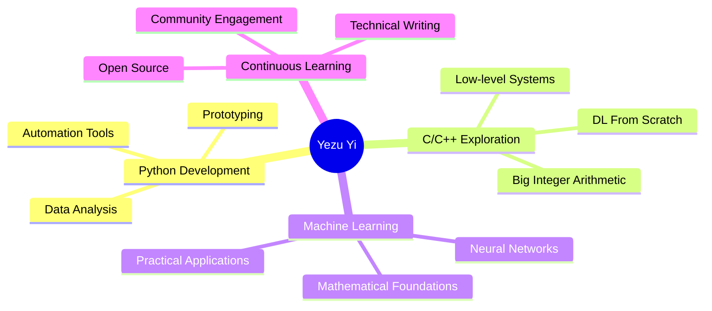

<div align="center">

<!-- Animated Header -->


### 🐍 Python Developer | 💻 C/C++ Enthusiast | 🤖 ML Explorer

<!-- Typing SVG -->
<a href="https://git.io/typing-svg"></a>

<br/>

[](https://www.linkedin.com/in/yezu-yi/)
[](https://velog.io/@js4484821266)
[](mailto:yezu.yi@pm.me)
[](https://github.com/js4484821266)

</div>

---

## 💡 About Me

🔭 I build **small, working prototypes** and **practical automation tools** with Python

🌱 Currently exploring **C/C++ internals** and **deep learning fundamentals**

💻 I believe in learning by **building from scratch**

📝 I share my journey on [**Velog**](https://velog.io/@js4484821266)

⚡ Fun fact: I enjoy **diving deep** into how things work under the hood

---

## 🚀 Featured Projects

<div align="center">

<table>
<tr>
<td width="50%" valign="top">

### 🔢 [ZZQQCC](https://github.com/js4484821266/ZZQQCC)


**Big Integer Playground in C++**

> A curiosity-driven experiment handling integers **beyond 64-bit** in C++. Learning arbitrary precision arithmetic through hands-on implementation.

🔹 Exploring custom big integer implementation  
🔹 Experimenting with mathematical operations  
🔹 Learning performance optimization  

[](https://github.com/js4484821266/ZZQQCC)

</td>
<td width="50%" valign="top">

### 🧠 [DeepLearning From Scratch](https://github.com/js4484821266/deeplearningfromscratchcpp)


**Learning by Building**

> Re-implementing core deep learning components in C++ from scratch to understand the fundamentals. A work-in-progress educational project.

🔹 Building neural network components  
🔹 Learning forward & backward propagation  
🔹 Ongoing educational implementation  

[](https://github.com/js4484821266/deeplearningfromscratchcpp)

</td>
</tr>
</table>

</div>

---

## 🛠️ Tech Stack & Tools

<div align="center">

### Languages


### Data Science & ML


### Tools & Platforms


</div>

### 📊 Skill Levels

```text
Languages        ████████████████████░░   Python, C/C++
Data Science     ███████████░░░░░░░░░░░   Pandas, NumPy (refreshing)
Deep Learning    ███████████░░░░░░░░░░░   Fundamentals, Math
Low-level        ████████████████░░░░░░   C/C++ Systems Programming
```

---

## 🏆 Awards & Recognition

<div align="center">

| 🗓️ Year | 🏅 Achievement | 📝 Details |
|:-------:|:---------------|:-----------|
| 🥉 **2021** | **CNU Creative SW Festival DevDay** | Encouragement Award<br/>✨ Solved 3/4 problems in Python |
| 🥈 **2019** | **Academic Excellence Scholarship** | Ranked 2nd in department/year<br/>🎓 Sangji University |

</div>

---

## 📚 Certifications & Training

<table>
<tr>
<td width="50%">

### 📐 Mathematics for Machine Learning
**Imperial College London** _(Coursera)_


- Linear Algebra
- Multivariate Calculus
- PCA & Dimensionality Reduction

[📜 View Certificate](https://coursera.org/share/e57773d01fa3dbebcfdef3a4fe02ac00)

</td>
<td width="50%">

### 🎯 LG Aimers 5th (2024)
**AI/ML Training Program**


- Machine Learning Fundamentals
- Model Development
- Real-world Applications

</td>
</tr>
</table>

---

## 📈 GitHub Stats

<div align="center">


</div>

---

## ✍️ Latest Blog Posts

<div align="center">

📝 **I share my learning journey and technical insights**

[](https://velog.io/@js4484821266)

<!-- Replace with actual blog post feed if available -->
*Topics: Python, C/C++, Machine Learning, Data Structures, Algorithms*

</div>

---

## 🎯 Current Focus

<div align="center">



</div>

## 💬 Let's Connect!

<div align="center">

**I'm always open to interesting conversations and collaboration opportunities!**

[](https://www.linkedin.com/in/yezu-yi/)
[](https://velog.io/@js4484821266)
[](mailto:yezu.yi@pm.me)

</div>

---

<div align="center">

### 💭 *"Building to learn, learning to build."*


</div>
